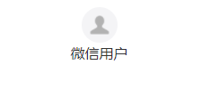

# 小程序头像昵称组件

只需要一行代码即可实现小程序用户头像昵称的展示与修改

### 使用效果


## 一些限制

### 最低基础库版本

最低基础库版本要求 2.21.2，因为依赖了 button(type="chooseAvatar") 和 input(type="nickname") 特性，这些特性在基础库 2.21.2 版本以上才有。

### 昵称校验

基础库版本低于 2.29.1 时不会进行昵称的合规性校验，因为input组件的bindnicknamereview事件在基础库版本 2.29.1 以上才有。

### 云存储缓存时间设置
当dataSource=cloud时，在云开发控制台设置用户信息目录缓存时间为0,避免用户设置用户信息后，清除了本地缓存，立即从云存储读取，命中缓存读不到最新的用户信息
配置如下


## 使用方法

### 1. 安装组件

```bash
npm i mp-user-avatar
```

### 2. 在页面的 json 配置文件中添加 mp-user-avatar 自定义组件的配置

```json
{
  "usingComponents": {
    "mp-user-avatar": "mp-user-avatar"
  }
}
```

### 3. WXML 文件中引用 mp-user-avatar

```html
<mp-user-avatar></mp-user-avatar>
```

#### mp-user-avatar 的属性介绍如下：
| 属性               | 类型     | 说明                                                                                                                                                                                                                                                                           | 默认值            |
|-------------------| ------- |------------------------------------------------------------------------------------------------------------------------------------------------------------------------------------------------------------------------------------------------------------------------------|----------------|
| dataSource        | string  | 用户信息数据来源<br>1. 'localStorage' - 组件自行保存至本地缓存<br>2. 'cloud' - 组件自行托管至云存储<br>3. 'props' - 通过组件属性传入<br><br>对于现有的小程序，如要保留原有的昵称头像数据，建议采用 `dataSource='props'` 的方式，自行处理头像昵称的读取和存储<br>对于新的小程序，三种数据源方案都可使用，注意采用 `dataSource='cloud'` 方案时，小程序需要开通云开发并且在渲染组件之前完成云开发环境初始化(wx.cloud.init) | 'localStorage' |
| localStorageKey   | string  | 用户信息缓存 key，dataSource='localStorage' 时必填                                                                                                                                                                                                                                   | 'UserInfo'     |
| openid            | string  | 用户 openid，dataSource='cloud' 时必填                                                                                                                                                                                                                                             | -              |
| cloudFileIdPrefix | string  | 存储文件的 fileId 前缀，dataSource='cloud' 时必填，如 'cloud://cloud1-xxxxx-13010230/'                                                                                                                                                                                                | -              |
| nickname          | string  | 昵称，dataSource='props' 时必填                                                                                                                                                                                                                                                    | -              |
| avatar            | string  | 头像url，dataSource='props' 时必填                                                                                                                                                                                                                                                 | -              |
| defaultNickname   | string  | 默认昵称                                                                                                                                                                                                                                                                          | '微信用户'       |
| defaultAvatar     | string  | 默认头像                                                                                                                                                                                                                                                                          | (一个灰色头像)    |
| display           | string  | 展示内容<br>1. 'avatar' - 仅头像<br>2. 'nickname' - 仅昵称<br>3. 'both' - 头像+昵称                                                                                                                                                                                                   | 'both'     |
| direction         | string  | 头像和昵称的排列方向<br>1. 'row' - 横排<br>2. 'column' - 竖排                                                                                                                                                                                                                         | 'row'          |
| editable          | boolean | 点击组件时是否进入编辑模式                                                                                                                                                                                                                                                            | true           |
| avatar-class      | string  | 外部样式类，修改头像样式                                                                                                                                                                                                                                                             | -               |
| nickname-class    | string  | 外部样式类，修改昵称样式                                                                                                                                                                                                                                                             | -               |
| bind:change       | 事件     | 头像或昵称修改完触发事件，event.detail = { userInfo: { avatar: string, nickname: string } }                                                                                                                                                                                          |  -              |
| bind:error        | 事件     | 程序发生异常（当dataSource为cloud时，参数格式不对或向云存储设置或获取用户信息失败）触发事件，event.detail = Error                                                                                                                                                                              |  -              |

#### mp-user-avatar 包含1个 slot，具体介绍如下：
| 名称       | 描述                               |
|---------- |------------------------------------|
| 默认 slot | 当展示昵称时可添加的额外内容,direction=row时可和昵称一块与头像居中对齐 |

### 4.有类型定义文件
在 tsconfig.json 中指定 types: ['mp-user-avatar']后可使用

### 代码示例

- display: 控制展示内容

```html
<mp-user-avatar display="avatar"></mp-user-avatar>
```

效果：


- direction: 头像和昵称的排列方向

```html
<mp-user-avatar direction="row"></mp-user-avatar>
<mp-user-avatar direction="column"></mp-user-avatar>
```

效果：




- externalClasses: ['avatar-class', 'nickname-class']: 控制头像和昵称样式

```html
<view class="mp-user-avatar-box">
  <mp-user-avatar avatar-class="avatar-style" nickname-class="nickname-style"></mp-user-avatar>
</view>
```

```scss
/* 给头像设置样式需加父元素提高优先级，覆盖组件内默认样式（width: 80rpx;height:80rpx） */
.mp-user-avatar-box .avatar-style {
  width: 150rpx;
  height: 150rpx;
}

.nickname-style {
  color: #333;
  font-size: 50rpx;
  height: 50rpx;
  line-height: 50rpx;
  margin-left: 20rpx;
}
```

效果：


- slot: 当展示昵称时可添加的额外内容,direction=row时可和昵称一块与头像居中对齐

```html
<mp-user-avatar>
  <view>附加信息</view>
</mp-user-avatar>
```

效果：


- 头像或昵称修改完触发事件

```html
<mp-user-avatar bind:change="onUserInfoChanged"></mp-user-avatar>
```

```ts
Page({
  onUserInfoChanged(e: MpUserInfo.UserInfoChangeEvent) {
    const { userInfo } = e.detail;
    const { avatar, nickname } = userInfo;
    console.log(avatar, nickname);
  }
});
```

- 当dataSource=cloud时，可能会有以下异常事件触发:参数格式不对、将用户数据写入本地失败、向云存储设置或获取用户信息失败、从下载文件读取用户信息失败

```html
<mp-user-avatar dataSource="cloud" bind:error="onError"></mp-user-avatar>
```

```ts
Page({
  onError(e: { detail: Error }) {
    const { message } = e.detail;
    console.log(message);
  }
});
```
